# CoinVue - Project 3

CoinVue is a cryptocurrency portfolio tracker and price tracker updating price movements to give users fast, accurate and informative data on their assets performance. The project's goal is to deliver a cryptocurrency portfolio service where users can keep track of their assets performance through buy, sell and staking records with live updates on the value of their portfolio.

## Table of contents

## 1.0 UX

### 1.1 User goals

#### 1.1.1 Target audience

CoinVue’s target audience are crypto retail investors interested in live market movements and trends broken down into easy to read data that they need to make further investments. As well as a way to track the performance of their portfolio and a place to store their records of purchases.      

### 1.2 User needs and goals

#### 1.2.1 User needs:

1. Accessibility for all users
2. Relevant updated data
3. Important data on assets
4. Sign up and log in
5. Password security 
6. Add, sell and staking rewards records
7. Portfolio charts
8. CRUD functionality

#### 1.2.2 How the user needs are met

1. All users should have equal opportunity through text transcript compatibility, color contrast that's readable, form labels, visual feedback and responsive breakpoints to support all devices
2. Fast, accurate and close to instant updated data to ensure no big price action isn't missed or inaccurate through Coinmarketcap API
3. More in depth breakdowns of individual assets when a user clicks on them such as supply, market cap, volume and price history
4. Users can sign up and log in to access and edit their portfolios with password protection 
5. To ensure account protection, users can create a password so other can log in
6. When adding records users can pick from 3 options as to add, sell and staking rewards to contribute to their portfolio
7. When 1 record is added to a portfolio the chart will update regularly to its current value
8. Users can create, read, edit and delete any of their records

### 1.3 Developer and business goals

#### 1.3.1 Goals of the business

1. To deliver an accurate service with relevant data
2. The website attracts retail investors
3. User traffic can be maintained and grow through sign ups
4. Users will interact and record transactions to improve user engagement
5. Growth in user numbers
6. Growth on listed assets

### 1.4 User stories

1. User wants to check recent performance of digital asset
2. User wants to add a record to their portfolio
3. User wants to sign up to create a portfolio
4. The user records the wrong information
5. The user wishes to view their individual records
6. User wishes to record a sell order

1.4.1 The user has invested in an asset and is looking to see how it has performed for the day with either a positive or negative percentage value based on the past 24 hours. The price tracker will act as the home page/hub listing the top 50 assets so the user only has to scroll down to find their asset.

1.4.2 The user has created an account and wants to record a transaction they have made, to do so they navigate to the My Portfolio page where they can click add transaction and fill out the form with three types of records: buy, sell and staking. The user can then fill out the appropriate sections and click the submit button where the record will then update their portfolio. 

1.4.3 The user is looking to create an account to share their strategies, which they can do through the sign up link in the nav where they can enter a username and password to protect their account. To access their account after its creation a login page will also be linked beneath the signup page for users with an account.

1.4.4 The user has recorded the wrong information when adding a transaction, the user can correct this mistake either by removing or editing the record. To do this the user goes to the portfolio page where their coins are listed, select the coin and scrolling through the record list and has the option of deleting the record which is represented through a bin icon and will prompt the user to make sure they want to do this which the user can select yes and it will be deleted. To edit the record the user clicks the edit icon where they can change the record's details.

1.4.5 The user wishes to view their records for a coin (Bitcoin), the user can find this on the portfolio page where all of their coins are listed along with the total holdings, value, etc which under the action row the user can click the button showing their coins individual records

1.4.6 The user has sold some of their crypto and wishes to record the sale, to do this the user goes to the portfolio page clicks add transaction and selects the sell tab. The user then can fill out the quantity of tokens sold, the price each token was valued at, date and optionally add a note.

## 2.0 Design choices

### 2.1 Fonts

Titles and subtitles will be in [Prompt](https://fonts.google.com/specimen/Prompt?query=prompt):

Text will be in [Exo-2](https://fonts.google.com/specimen/Exo+2?query=exo+2):

### 2.2 Icons

[Font awesome:](https://fontawesome.com/)

- YouTube icon
- Facebook icon
- Instagram icon
- Twitter icon
- Home icon (Home page)
- Coins icon (Portfolio page)
- User icon (Log in page)
- Edit icon (Delete modal)
- Delete icon (Delete button)
- Ellipsis vertical (Action button)

### 2.3 Colors

- #FFAC5E - Primary color for text
- #161B22 - Nav and Footer background
- #070A0F - Portfolio background color
- #0D1117 - Background color

### 2.4 Wireframes

[Wireframe pdf](static/wireframes/CoinVue.pdf)

Home Desktop wireframe:

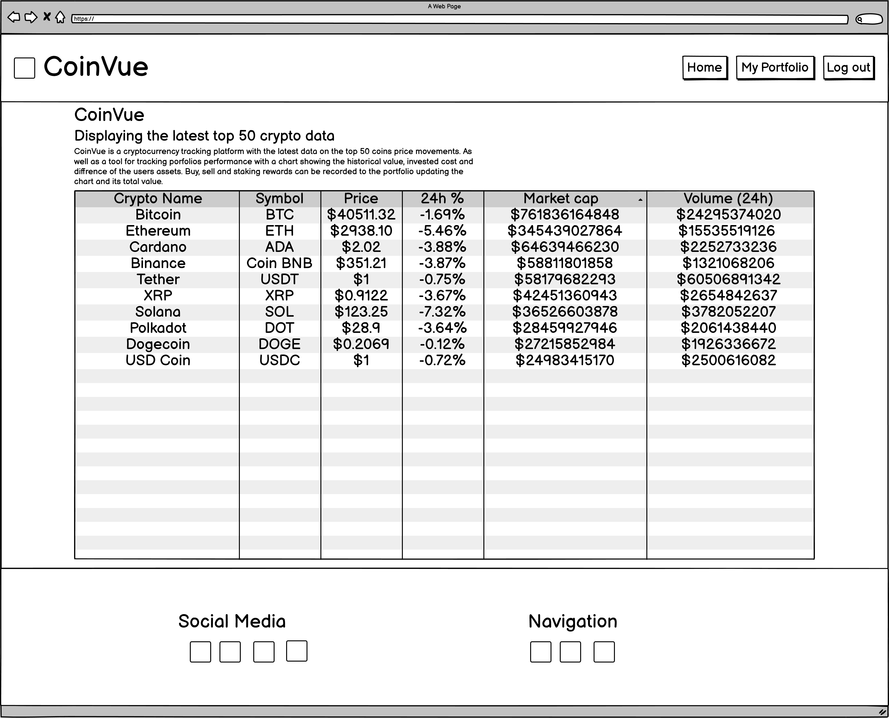

Home Tablet wireframe:

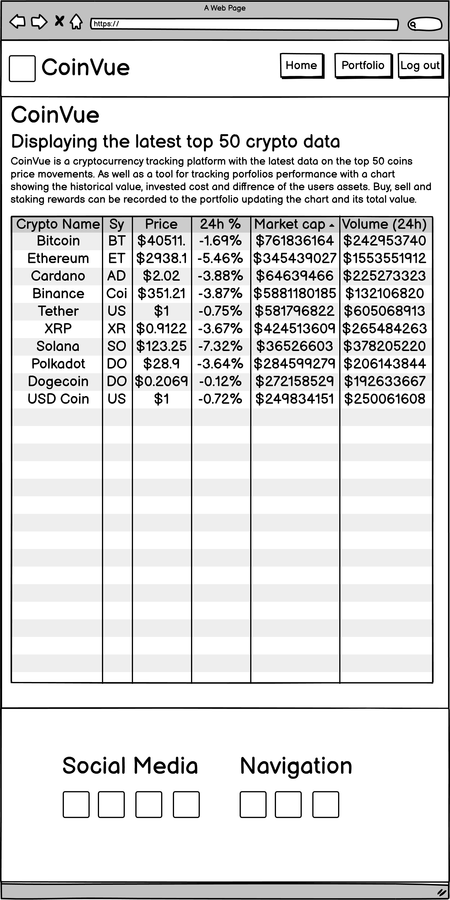

Home Mobile wireframe:

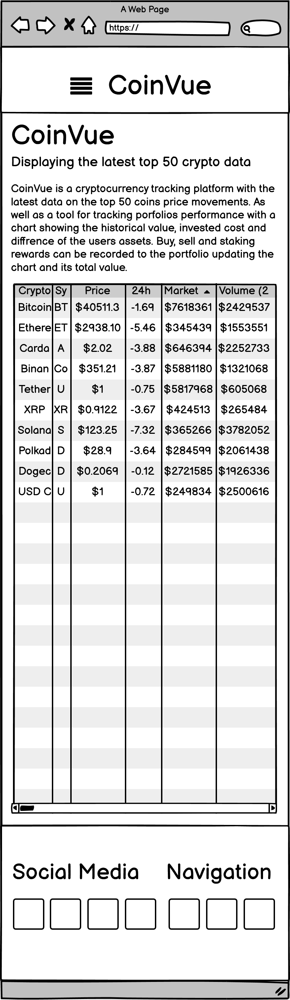

Portfolio Desktop wireframe:

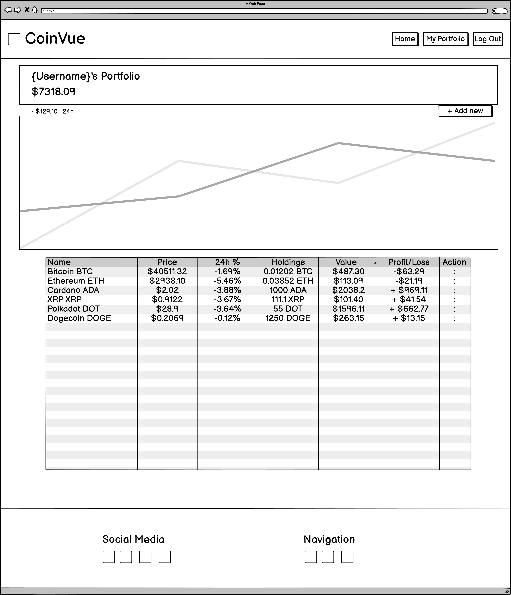

Portfolio Tablet wireframe:

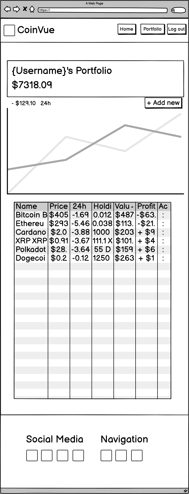

Portfolio Mobile wireframe:

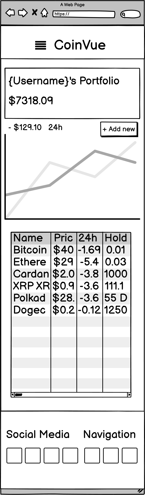

Sign up Desktop wireframe:

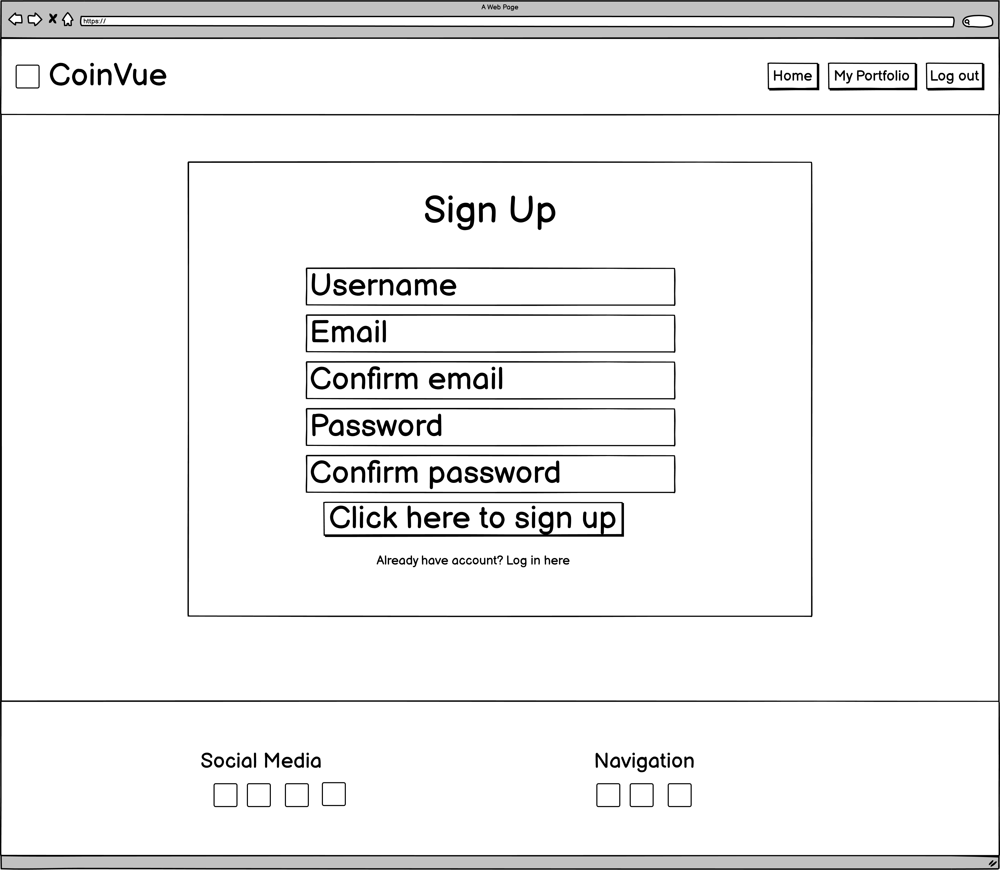

Sign up Tablet wireframe:

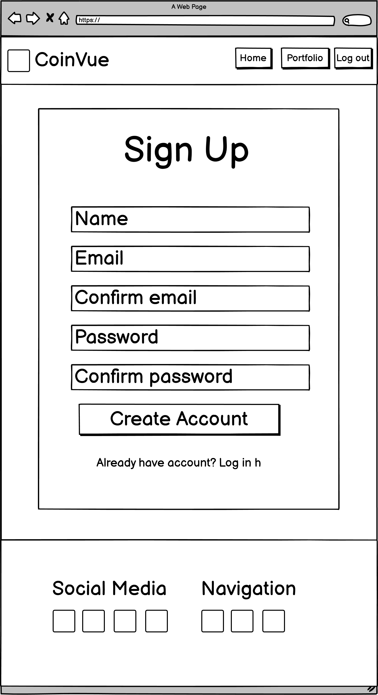

Sign up Mobile wireframe:

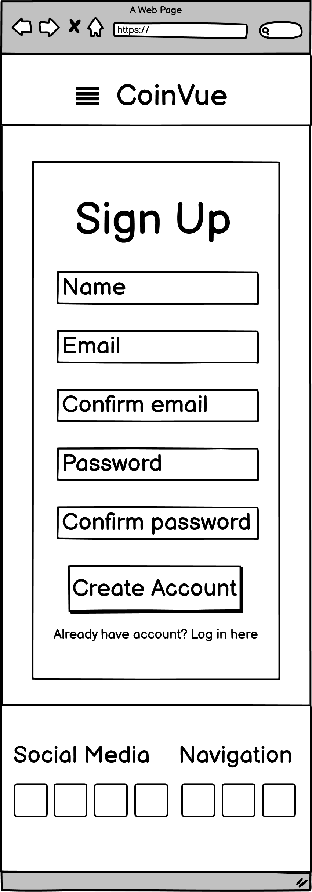

Log in Desktop wireframe:

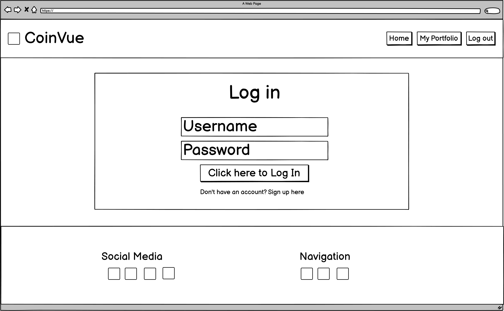

Log in Tablet wireframe:

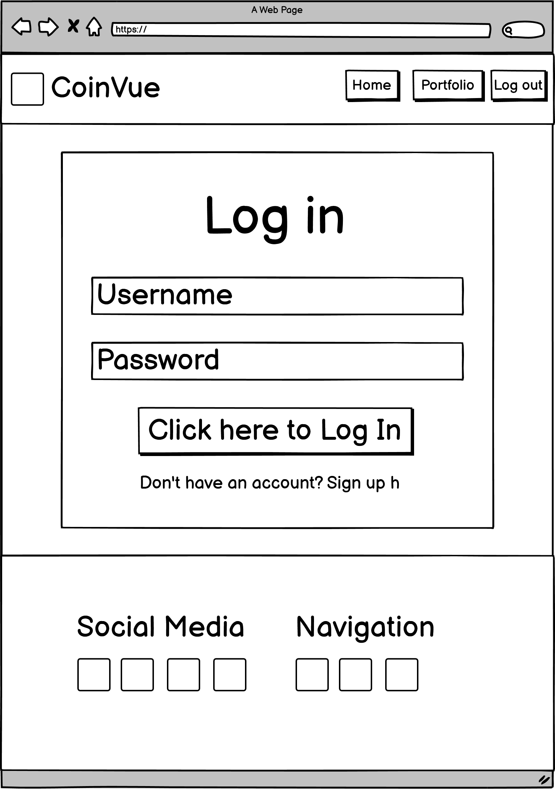

Log in Mobile wireframe:

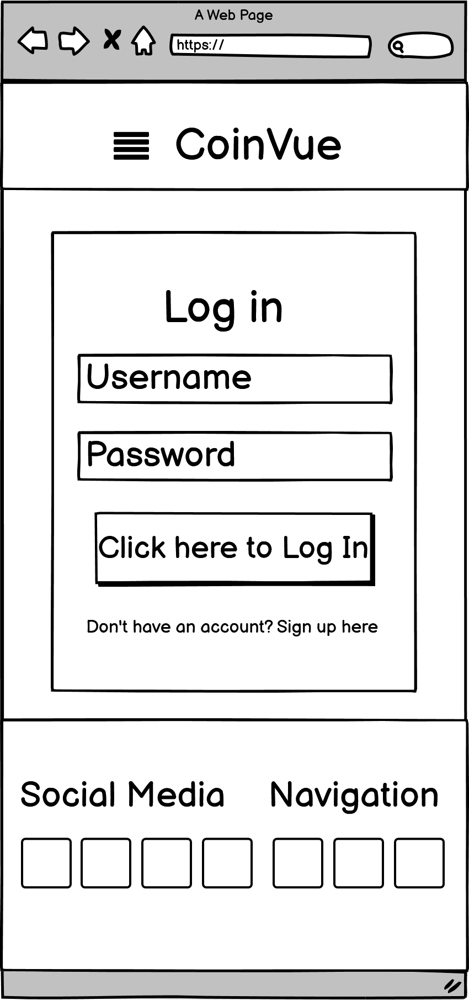

Transaction Modal Universal wireframe:

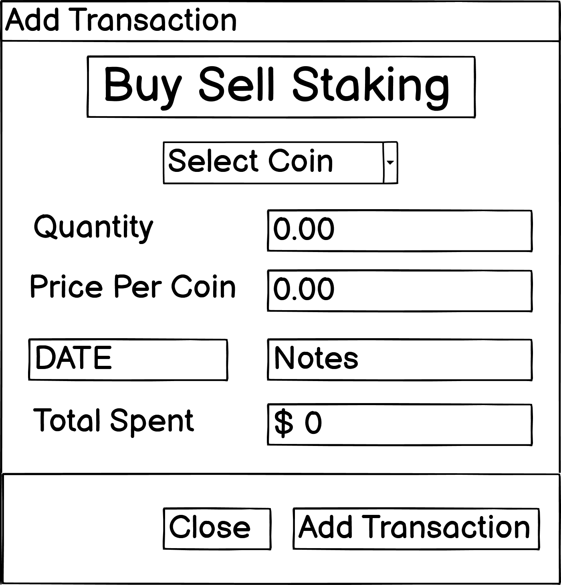

Edit Modal Universal wireframe:

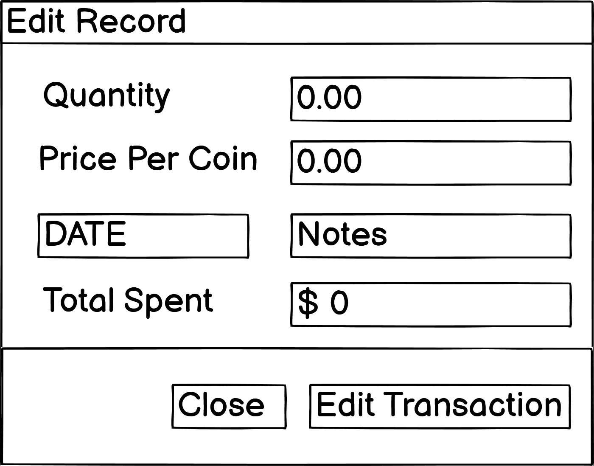

Record Modal Desktop wireframe:

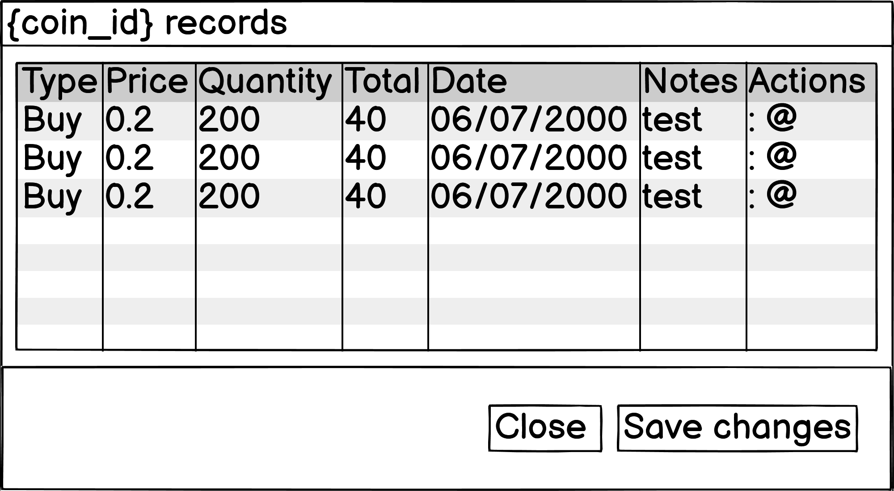

Record Modal Mobile wireframe:

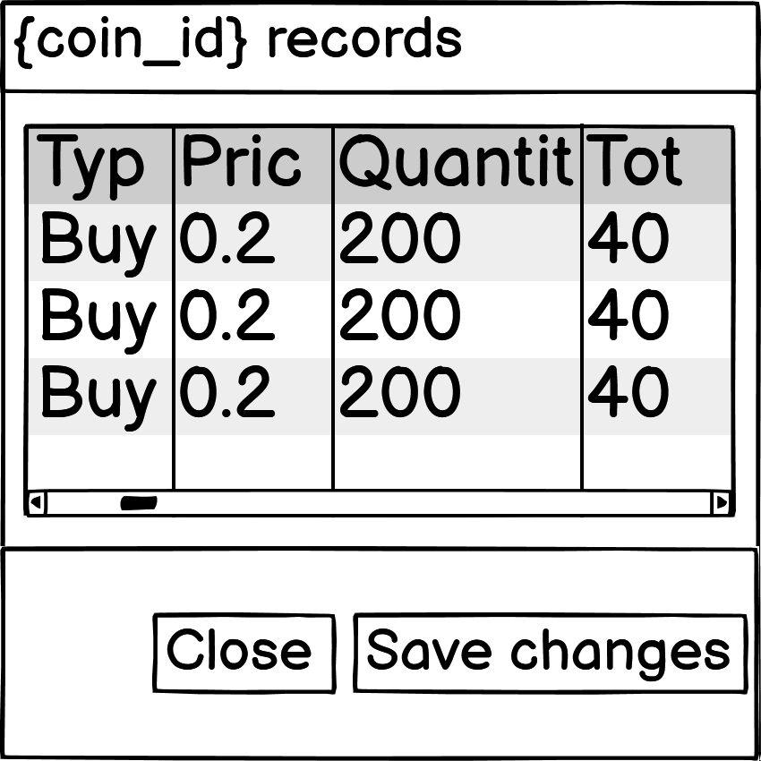

Delete Modal Universal wireframe:

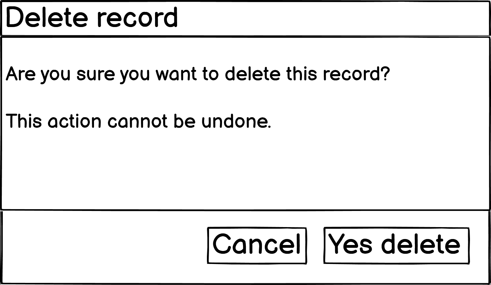

### 2.5 Mockups

[Mockup pdf](static/mockups/)

Home Desktop mockup:

Home Tablet mockup:

Home Mobile mockup:

Portfolio Desktop mockup:

Portfolio Tablet mockup:

Portfolio Mobile mockup:

Sign up Desktop mockup:

Sign up Tablet mockup:

Sign up Mobile mockup:

Log in Desktop mockup:

Log in Tablet mockup:

Log in Mobile mockup:

Transaction Modal Universal mockup:

Edit Modal Universal mockup:

Record Modal Desktop mockup:

Record Modal Mobile mockup:

Delete Modal Universal mockup:

## 3.0 Features

### 3.1 Existing features

- Crypto price tracker - Home page with the top 50 cryptos
- Personal portfolio - Users portfolio tracking the users transaction records
- Sign up page - Personal user accounts
- Log in / out - Log in and out to change accounts
- Buy records - Buy transaction record for new purchases
- Sell records - Sell transaction to keep track of profits
- Staking rewards records - Rewards from passive income coins
- ChartJS portfolio chart - Chart to track and visualize portfolio history
- Edit records - Change pre existing records
- Delete records - Permanently remove records
- Updated portfolio performance - Updates changes in value when user reloads page

### 3.2 Features left to implement

- Share portfolios - Users could view and share portfolios on discover page to better improve their trading stratergy 
- Public and private portfolios - Users could have option to share or private there portfolios
- Add transfer records - Crypto sent to or from others could be recorded 
- Change password - Users could change their password if they forgot or wanted to make it more secure
- Search bar for assets - Search bar to better filter down cryptocurrencies
- Crypto info page - Pages for each crypto with further information on them

## 4.0 Technologies used

### 4.1 HTML5

HTML5 used to structure the websites information

### 4.2 CSS3

CSS3 used to style, structure and responsive on all devices

### 4.3 Bootstrap 4.5

CSS libary with pre-existing class and id's to speed up development

### 4.4 JavaScript

JavaScript makes this project interactable for users

### 4.5 jQuery

jQuery used to shortan JS being written and for bootstrap elements such as modals, accordians and dropdown menus

### 4.6 Python 3

Python is used for backend functionality between user, website and mongoDB.

### 4.7 Flask

Flask is used for HTML templates, URL routing making devlopement more efficient

### 4.8 MongoDB

MongoDB is used as the database to store user accounts, portfolios and records

### 4.9 CoinMarketCap API

CoinMarketCap API is used to get the latest listings, price, price changes, market caps and 24 hour volume for the top 50 Cryptos

## 5.0 Testing

[Click here for Testing document](testing.md)

## 6.0 Devlopment life cycle

### 6.1 Initial commit

Additions:

- Code Institute gitpod template
- .gitignore file
- app.py
- env.py
- Create Flask app

### 6.2 Updated README Section 1 UX

Additions:

- README Section 1 UX

### 6.3 Updated README Sections 2 to 5

Additions:

- README Section 2 Design Choices
- README Section 3 Features
- README Section 4 Technologies used
- README Section 5 Testing

### 6.4 Updated README Section 6 Devlopment life cycle

Additions:

- README Section 6 Devlopment life cycle

### 6.5 Updated README Sections 7 to 8

Additions:

- README Section 7 Deployment
- README Section 8 Credits

### 6.6 Add requirments.txt

Additions:

- Add requirments.txt

### 6.7 Add Procfile

Additions:

- Add Procfile

### 6.8 Deploy to heroku

Additions:

- Deployed to heroku

### 6.9 Add basic file structure

Additions:

- static file
- css file
- style.css
- js file
- script.js
- templates file
- index.html
- base.html

### 6.10 Added bootstrap and jQuery

Additions:

- Added Bootstrap
- Added jQuery
- Base template structure

### 6.11 Added basic nav-bar

Additions:

- Added nav bar

### 6.12 Added basic footer

Additions:

- Added footer

### 6.13 Added log in, sign up page and links to nav and footer

Additions:

- Added log in page
- Added sign up page
- Added links to nav-bar
- Added links to footer

### 6.14 Log in and sign up page css

Additions:

- Log in and sign up page css
- Sign up page form

### 6.15 Added CoinMarketCap API

Additions:

- Added CoinMarketCap API

### 6.16 Registration functional and flash messages added

Additions:

- Added flash messages to sign up
- Sign up page fully functional

### 6.17 Log in functionality, portfolio and profile page

Additions:

- Flash messages appear for users when signed in
- Added portfolio.html
- Added profile.html

### 6.18 Nav-bar changes based on if user is signed in or not

Additions:

- Sign up button on nav bar
- Sign out button on nav bar
- Logged in users have access to profile, my portfolio and log out
- Logged out users have access to log in and sign up on nav-bar

### 6.19 Basic portfolio page structure and crypto record modal

Additions:

- Basic portfolio page structure
- Crypto record modal

### 6.20 Crypto record form POST's to mongodb

Additions:

- Crypto record form POST's to mongodb

### 6.21 Crypto record POST's username and total cost to mongodb

Additions:

- Crypto record POST's username
- Crypto record POST's total cost

### 6.22 Portfolio page table basic structure

Additions: 

- Portfolio grid table basic structure

### 6.23 Home page crypto tracker updates when reloaded

Additions:

- Home page Crypto price tracker
- Tracker updates when user reloadeds page
- Home page basic structure

### 6.24 Issues with get_price, get_name functions and updates to front page

Additions:

- coinvue.py get_price function
- coinvue.py get_name function
- Portfolios record progress
- Update to home page

Issues #1 - (get_name) Unable to make list of names for crypto options for users to pick

Issues #2 - (portfolio collection) Unable to find records with the same crypto currency name to total up the users holdings / grand total, the value of there crypto and their profits / loses

Issues #3 - (get_price) Unable to get the cryptos current price as well as way to get price for the correct crypto

### 6.25 More Crypto options for users to pick from

Additions:

- Users can now pick from more cryptos as the options are tacken from CoinMarketCap dictionairy
- Issue #1 resolved was calling from add_record rather then portfolio

Issue RESOLVED #1 - (get_name) Unable to make list of names for crypto options for users to pick

### 6.26 Changes to my_portfolio functionality 

Additions:

- Updates to app.py
- my_portfolio collection

### 6.27 Changes to home page, nav-bar and footer css

Additions:

- Home page background color
- Nav-bar links curved, hover animation and changes to color
- Footer CSS changes to color

### 6.28 Mobile nav bar breakpoints

Additions:

- My portfolio css changes
- Nav bar breakpoints mobile

### 6.29 Mobile footer breakpoints and updates to nav-bar mobile

Additions:

- Mobile nav-bar drop down menu appears infront of the text
- Changed the order of logo, title and drop down menu
- Footer mobile and small mobile responsive breakpoints
- Mobile home page crypto table scrolls horizontally

### 6.30 Responsive home page and removal of profile page

Additions:

- Home page is responsive on all devices
- Removing of profile page, when user logs in they will be redirected to their portfolio

### 6.31 Responsive log in and sign up page on all devices

Additions:

- Log in page is responsive on all devices
- Sign up page is responsive on all devices

### 6.32 Responsive portfolio page and new fonts for titles and text

Additions:

- Portfolio page is responsive on all devices
- Added Prompt title font
- Added Exo 2 text font

### 6.33 Responsive Nav-bar and changes to mobile Nav-menu

Additions:

- Responsive nav-bar on all devices 
- Removed CoinVue logo on mobile devices
- Changes to mobile nav-menu

### 6.34 Added action button, records modal, sign up link on home page and mobile modal support

Additions:

- Added a sign up link to home page if user is not signed in
- Added action button to My porfolio
- Added Records modal desktop
- Mobile transaction modal works

### 6.35 Transaction modal tabs added with functional buy order

Additions:

- Changed button group for tranaction modal to a tab list
- Buy order tab complete successful POST

### 6.36 Sell and staking tabs POST to MongoDB

Additions:

- Sell order tab complete successful POST
- Staking order tab complete successful POST

Issue #4 - Each tab the div is still present although its contents are hidden pushing down the user selected tab

### 6.37 Tab issue resloved and new edit modal added

Additions:

- Edit modal added
- Fixed the empty tab contents issue

Issue RESOLVED #4 - Tabs only show the selected contents without empty spaces

### 6.38 Mobile support for Transaction and Edit modals

Additions:

- Mobile Transaction tabs updated buy, sell and staking
- Mobile Edit modal works on smaller devices
- Removed desktop edit button from portfolio section

### 6.39 app.py updates to add_record and edit_record

Additions:

- app.py changes to how buy, sell and transfer orders are recorded into the portfolio
- edit_record progress not yet functional

### 6.40 Displays records to record modal desktop but not user specific ones

Additions: 

- Displays records to record modal desktop but not user specific ones

### 6.41 Returns user specific records in most recent date order

Additions:

- Returns records that a specific to the user
- Sorts the records by most recent date 

### 6.42 Heroku test

Additions:

-  Deployed to heroku

### 6.43 Home page improvements on desktop and mobile as well as delete button issues 

Additions:

- Added home page sign up link to mobile
- Added home page description of CoinVue desktop and mobile
- Delete button issue

Issue #5 - Delete button links to page that doesn't exist due to record_id not being regonised

### 6.44 Portfolio displays but not the individual coins, holdings, value, etc

Additions:

- Improvements to portfolio functionalty
- Portfolio page displays the porfolio but not the individual coins, holdings, value, etc

### 6.45 README updates 1.0 UX

README Updates:

- Overview
- Target audience
- Users needs
- How they are met
- Goals of buisness
- User stories

### 6.46 Nav-bar icons, Footer updated links and README updates 2.0 Design Choices, 3.0 Features, 4.0 Tech used

Additions:

- Footer portfolio link
- Nav bar icons desktop and tablet

README Updates:

- Fonts
- Icons
- Colors
- Existing features
- Features left to implement
- Technologies used

### 6.47 Testing file added, README updates 7.0 Deployment and 8.0 Credits

Additions:

- testing.md file

README Updates:

- Local deployment
- Github deployment
- Heroku deployment
- Content credits
- Code credits

### 6.48 Test file updates 5.1 to 5.6 and changes to sign up page linking to portfolio

Additions:

- Changes to sign up page, when user is signed up it links them to portfolio page rather then sign up page

Test file Updates:

- Code validator tests
- Nav-bar tests
- Footer tests
- Home page tests
- Log in page tests
- Sign up page tests

### 6.49 Test file updates 5.7 to 5.10

Test file Updates:

- Portfolio tests
- Record modal tests
- Transaction modal tests
- Edit modal tests

### 6.50 Adding wireframe pdf and images to README

Additions:

- Wireframe folder
- Wireframe pdf
- home-desktop
- home-tablet
- home-mobile
- portfolio-desktop
- portfolio-tablet
- portfolio-mobile
- signup-desktop
- signup-tablet
- signup-mobile
- login-desktop
- login-tablet
- login-mobile
- transaction-universal
- edit-universal
- record-desktop
- record-mobile
- delete-universal

### 6.51 Mockup file, updated flash messages, delete all tokens, text for transaction types 

Additions:

- Mockups folder
- Updated the flash messages
- Added Delete all button to portfolio page
- Changes to app.py portfolio function
- Added text giving small explanation on transactions

### 6.52 Transaction, Edit and Delete modals desktop and mobile support

Additions:

- Changes to transaction modile desktop and mobile
- Changes to Edit modile desktop and mobile
- Changes to Delete record modile desktop and mobile
- Changes to Delete All record modile desktop and mobile

### 6.53

Additions:

- 

## 7.0 Deployment

### 7.1 Local deployment

This project was developed on GitPod.

To devlop this project these steps where taken:

1. Create a new repository on GitHub
2. Click "GitPod" button on GitHub to create the work enviroment
3. Create and work on files on GitPod
4. Create .gitignore file to add files that should't be commited to GitHub
5. Using GitPods terminal add, commit and push files to GitHub

### 7.2 GitHub pages deployment

To upload the project to GitHub pages these steps where taken:

1. Go to coin_vue repository settings
2. Scroll down to GitHub pages section
3. Select the branch to be uploaded
4. Select the folder and click save

The project is then published to GitHub pages generating a link to the live website

### 7.3 Heroku deployment

1. From Heroku's website sign in and click "New", "Create new app"
2. Enter a app name "coin-vue" and region then click "Create app"
3. Go to the settings then scroll to "Reaveal Config Vars" and enter the appropriate details from env.py file: "IP", "PORT", "SECRET_KEY", "MONGO_DBNAME", "MONGO_URI"
4. To deploy GitHub to Heroku first create a Procfile using this command in the terminal: echo web: python app.py > Procfile
5. Then create a requirments file that contains all of the relevant packages using the command: pip3 freeze --local > requirements.txt
6. Go to the Deploy tab to search and connect the GitHub repository to Heroku
7. Enable Automatic Deploys for automatic updates when code is commited to GitHub, select the branch and deploy to Heroku

## 8.0 Credits

### 8.1 Content

- CoinVue Logo - [CoinVue](https://thumbs.dreamstime.com/b/blockchain-technology-icon-vector-block-chain-symbol-blockchain-technology-modern-icon-vector-block-chain-symbol-logo-element-106099068.jpg 
)
- Icons - [Font Awesome](https://fontawesome.com/)

### 8.2 Code

- CoinMarketCap API display data index.html - [Python Flask Web Application Tutorial](https://blog.tati.digital/2020/11/30/python-flask-web-application-tutorial-2020-display-coinmarketcap-api-data/)
- Bootstrap Nav-bar base.html - [Nav](https://getbootstrap.com/docs/4.5/components/navbar/)
- Bootstrap Modals portfolio.html - [Modal](https://getbootstrap.com/docs/4.5/components/modal/)
- Bootstrap Accordion portfolio.html - [Accordion](https://getbootstrap.com/docs/4.5/components/collapse/#accordion-example)
- Bootstrap Dropdown portfolio.html - [Dropdown](https://getbootstrap.com/docs/4.5/components/dropdowns/)
- Bootstrap Tab Pills portfolio.html - [Tab Pills](https://getbootstrap.com/docs/4.5/components/navs/#tab)
- Code Insitute mini Flask project app file - [Code Insitute](https://learn.codeinstitute.net/dashboard)
- CoinMarketCap documentation functions app file - [CoinMarketCap](https://coinmarketcap.com/api/documentation/v1/#operation/getV1CryptocurrencyListingsLatest)

